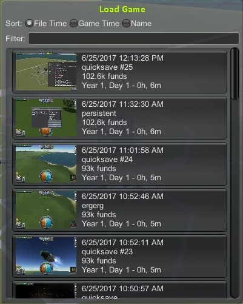

# BetterLoadSaveGame

An addon for Kerbal Space Program designed to improve the user interface for loading save games.

I was always frustrated with the in-game GUI for loading saved games, as it lists them in alphabetical order making it really hard to find the save you want when there's lots in the list. It also gets really slow to open once you have a lot of saves.

This mod attempts to fix that by:
* Listing the saves by creation time (descending)
* Including thumbnail screenshots

Looks like this:

## Installation

Copy the contents of the `GameData` folder into the `GameData` folder inside your KSP install.

## Usage

Press F7 in game to toggle the window on/off, and click on the buttons to load games.

## Recommended mods

Highly recommend also using a mod like [Dated Quick Saves](http://forum.kerbalspaceprogram.com/index.php?/topic/97033-13122-magico13s-modlets-sensible-screenshot-dated-quicksaves-etc/) or [Kerbal Improved Save System](http://forum.kerbalspaceprogram.com/index.php?/topic/138001-130-kiss-kerbal-improved-save-system/) to address my other favourite problem in the game of only having one quicksave slot when you press F5.

## Current state

This is my first mod and it's a work in progress right now, and I'm planning to add more features before it's done. I've also only tested it with KSP 1.2.2 so far. If it doesn't work in another version, or you have other troubles with it, please let me know.

Some changes I'd like to make:
* Filtering/sorting options
* Display more info about each game - maybe the active vessel name
* Any ideas?
